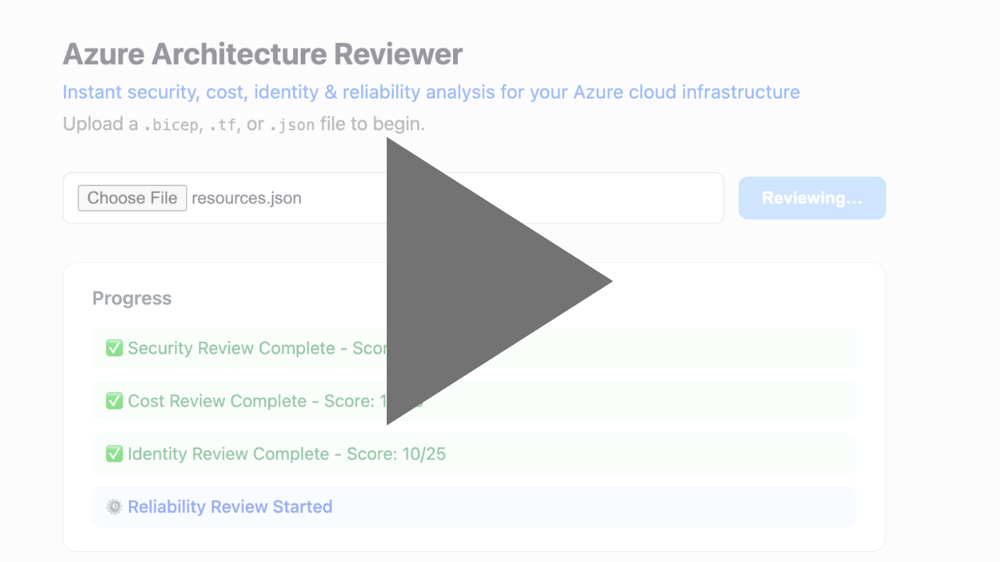
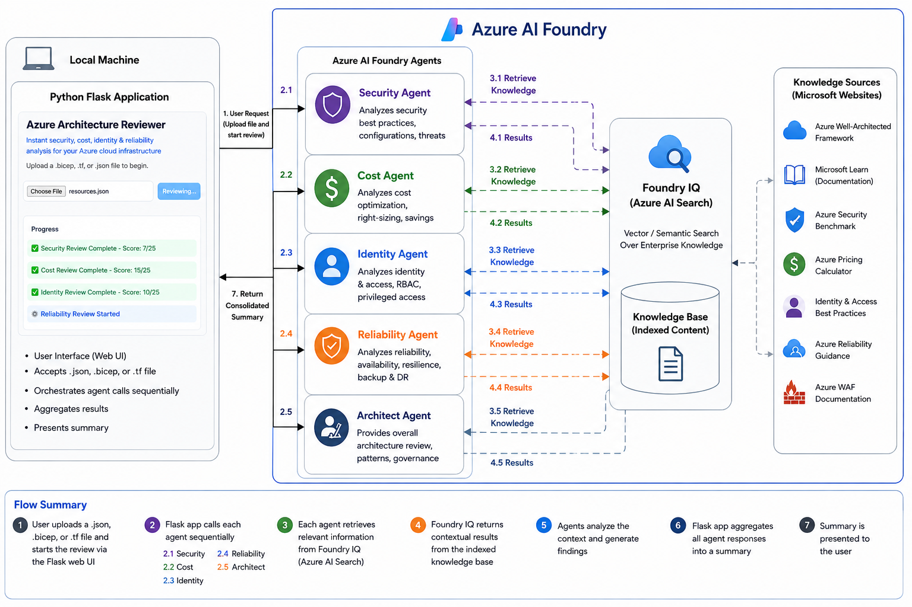
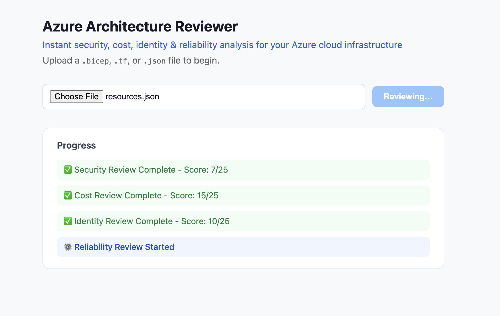
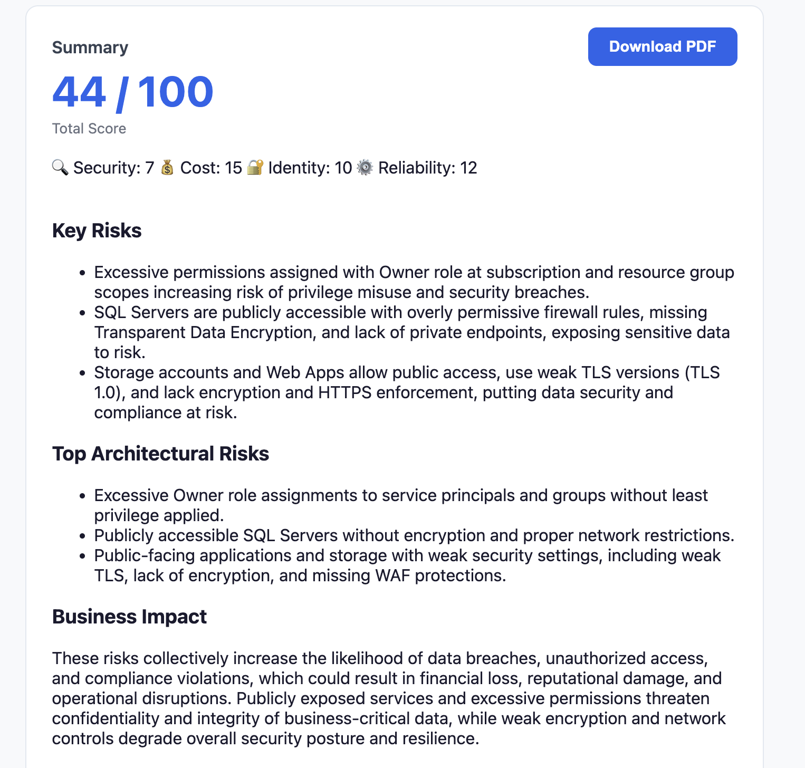

# Azure-Architecture-Reviewer

The Azure Architecture Reviewer is a multi-agent Azure architecture assessment platform that provides automated security, cost, identity, and reliability reviews with actionable recommendations using Azure AI Foundry Agents and Python Flask.

## Demo

You can watch a demo of the Azure Architecture Reviewer below:

## Overview

The Azure Architecture Reviewer allows users to upload Azure infrastructure definitions in:

- JSON
- Terraform (.tf)
- Bicep (.bicep)

The application orchestrates multiple Azure AI Foundry agents that independently evaluate the file and generate findings. Each agent is connected to a centralized knowledge base powered by Azure AI Search (Foundry IQ), which indexes Microsoft architecture guidance and best practices.

The results are consolidated into a single architecture review report with prioritized recommendations.

## Architecture

### Python Flask Application

Runs locally and serves as the orchestration layer.

Responsibilities:

- Accept infrastructure files
- Parse and prepare architecture context
- Invoke Azure AI Foundry agents sequentially
- Stream progress updates to the UI
- Aggregate findings into a final report

### Azure AI Foundry Agents

| Agent             | Responsibility                                                 |
| ----------------- | -------------------------------------------------------------- |
| Security Agent    | Security posture, threats, vulnerabilities, best practices     |
| Cost Agent        | Cost optimization, right-sizing, savings opportunities         |
| Identity Agent    | RBAC, least privilege, managed identities                      |
| Reliability Agent | Availability, resiliency, backup and disaster recovery         |
| Architect Agent   | Overall architecture patterns, governance, and recommendations |

### Foundry IQ (Azure AI Search)

Provides retrieval-augmented generation (RAG) capabilities.

Indexes Microsoft guidance including:

- Azure Well-Architected Framework
- Azure Security Benchmark
- Microsoft Learn Documentation
- Azure Reliability Guidance
- Azure Pricing Guidance
- Identity & Access Management Best Practices
- Azure WAF Documentation

### Architecture Flow

1. User uploads a JSON, Terraform, or Bicep file.
2. Flask application parses the infrastructure definition.
3. Security Agent performs analysis.
4. Cost Agent performs analysis.
5. Identity Agent performs analysis.
6. Reliability Agent performs analysis.
7. Architect Agent performs overall review.
8. Each agent retrieves relevant context from Foundry IQ.
9. Findings are returned to the Flask application.
10. Results are aggregated into a consolidated architecture review.
11. Final summary is presented to the user.
12. The user has the option to download the summary as a PDF.

## Tech Stack

### Frontend

- HTML
- CSS
- JavaScript

### Backend

- Python
- Flask

### AI & Search

- Azure AI Foundry
- Azure AI Foundry Agents
- Azure AI Search
- Retrieval Augmented Generation (RAG)

### Knowledge Sources

- Azure Well-Architected Framework
- Microsoft Learn
- Azure Security Benchmark
- Azure Pricing Guidance
- Azure Reliability Documentation
- Azure Identity Documentation

## Features

### Multi-Agent Review

Independent domain-specific analysis for:

- Security
- Cost
- Identity
- Reliability
- Architecture

### Real-Time Progress Tracking

Users can monitor review progress as each agent completes its analysis.

### Microsoft Knowledge Grounding

Every recommendation is grounded in Microsoft guidance retrieved from Azure AI Search.

### Consolidated Executive Summary

The Architect Agent combines findings from all review domains into a single report with:

- Overall architecture score
- Key risks
- Cost optimization opportunities
- Reliability concerns
- Identity recommendations
- Prioritized remediation steps

## Example Use Cases

### Architecture Reviews

Evaluate Azure environments against Microsoft best practices.

### Cloud Governance

Identify policy, security, and compliance gaps.

### Cost Optimization

Discover savings opportunities and resource inefficiencies.

### Security Assessments

Detect risky configurations and security weaknesses.

### Well-Architected Reviews

Perform lightweight automated Well-Architected Framework assessments.

## How I Built This?

Interested in the implementation details behind Azure Architecture Reviewer?

See the detailed build guide:

[How I Built Azure Architecture Reviewer](./BUILD-GUIDE.md)

## Important Notes

1. Only one file can be uploaded per review. The application currently accepts a single .json, .tf, or .bicep file at a time.

2. Terraform variable files are not yet supported. If your Terraform configuration relies on .tfvars or multiple module files, combine the relevant configuration into a single Terraform file before uploading.
